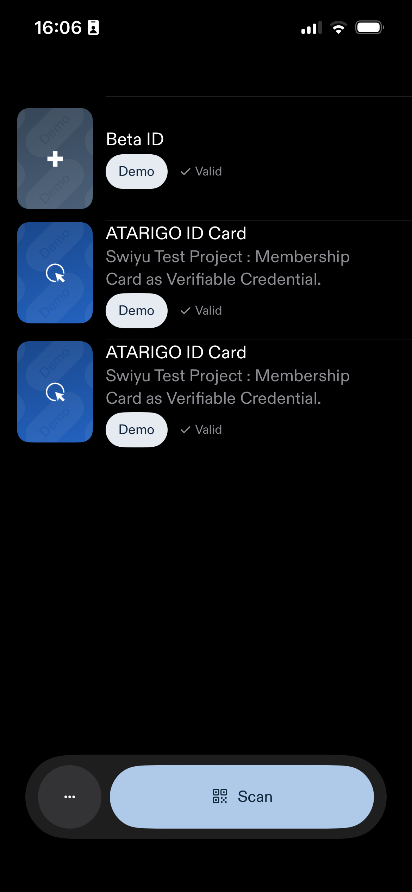
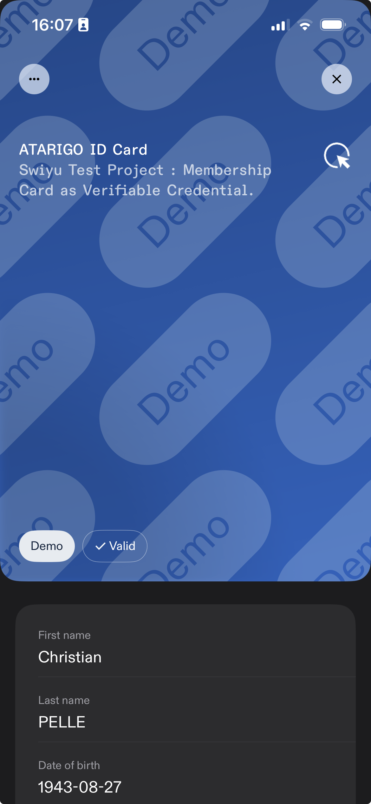

# Issuer workflow : create Verifiable Credentials

Now that our organisation is trusted and has its place in the Base Registry, we can run a real end-to-end test that a) issues a verifiable credential and b) loads it into the swiyu wallet.

## Demo pre-requisites

For the demo to work, we need the following :

- [ ] Load configuration : source swiyu_env_issuer.txt
- [ ] Start Issuer Back-end : swiyu api service : runs on localhost (Docker)
- [ ] Initiate ngrok tunnel : internet --> localhost/swagger
- [ ] ngrok url --> inserted into vercel proxy config

If conditions are not met - the demo is not going to work.

!!! warning "Manual steps for now"

    At the moment, this can be done manually. \
    I will try to automate it through a remote ssh access to my mac mini in order to trigger a script to secure a run time.
    

## SWIYU issuer demo

<form id="vc-form">
  <label for="firstName">First Name:</label>
  <input type="text" id="firstName" required>
  
  <label for="lastName">Last Name:</label>
  <input type="text" id="lastName" required>
  
  <label for="birthDate">Birth Date:</label>
  <input type="text" id="birthDate" required>
  
  <label for="membershipClass">Membership Class:</label>
  <select id="membershipClass" required>
    <!-- Options will be populated by JavaScript -->
  </select>
  
  <label for="validFrom">Valid From:</label>
  <input type="text" id="validFrom" readonly>
  
  <label for="validUntil">Valid Until:</label>
  <input type="text" id="validUntil" readonly>
  
  <label for="statusList">Status List URL:</label>
  <input type="text" id="statusList" readonly>
  
  <button type="submit">Generate Credential Offer</button>
</form>

<h3 class="output-title">Step 1: Generated cURL Command ⛳️</h3>
<pre id="curl-command" class="output-content"></pre>

<h3 class="output-title">Step 2: Raw API Response 🏁</h3>
<pre id="raw-response" class="output-content"></pre>

<h3 class="output-title">Step 3: Claim Your Credential 🎯</h3>

## Swiyu App

Now once a new Verifiable Credential has been issued, it can be retrieved by one instance (person/Swiyu app). The below picture of my mobile phone shows how these cards are then installed into your Swiyu Wallet.

<figure markdown>
{ width=50% }
<figcaption markdown> Illustration of Swiyu eWallet app</figcaption>
</figure>

<figure markdown>
{ width=50% }
<figcaption markdown> Credential loaded into Swiyu eWallet app</figcaption>
</figure>