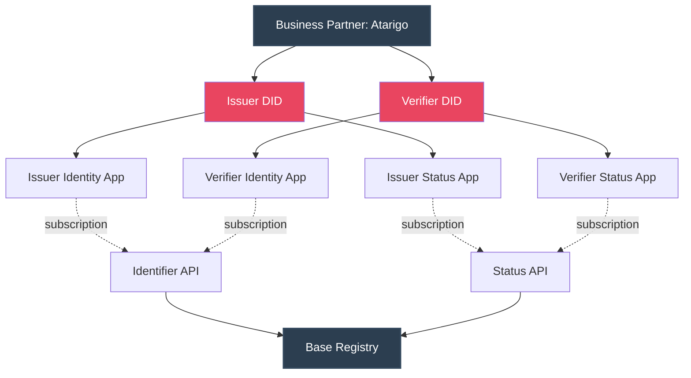

# Verifier workflows

## Verifier onboarding to Base Registry

This section explains the creation of an additional identifier for the Verifier role, next to the [Partner ID](role_business_partner/#business-partner-id) and Issuer identifier.

!!! warning "DID isolation"
 
    Ideally, the Verifier should/could be an entirely separated entity thus going through its own set-up process (with its own DID). But for the beta/testing purpose phase, the Business Partner identity is still being used - which also fits my set-up.
    
    This is quite an important point. What we'd like is no tracking of personal transactions : this is the design purpose (transparency, decentralisation). If Issuer and Verifier share the same identity, it defeats that purpose. This should be alleviated at a more advanced stage.

<figure markdown>
{ width=100% }
<figcaption markdown> SWIYU Trust Infrastructure : Roles</figcaption>
</figure>

## Verifier DID creation and upload

The below mermaid flowchart aims at describing the different steps & identities.

As a result, we'll need to handle separete .env configurations : `swiyu_issuer_env.txt` and `swiyu_verifier_env.txt`. The way these are meant to be used : as you progress in the workflow, add/update the variables in the .txt file and source the file iteratively again.

What worked best for me (leveraging Base Registry [cookbook](https://swiyu-admin-ch.github.io/cookbooks/onboarding-base-and-trust-registry/)):

- [x]	Set defaults in  swiyu_env_verifier.txt 
- [x]	Create Verifier_ID and Verifier_ST apps in API self-portal
- [x]	Subscribe to Identifier and Status APIs in API self-portal
- [x]	Retrieve Access + Refresh tokens || one customer key/secret per app
	- CUSTOMER_KEY ,  CUSTOMER_SECRET ,  ACCESS_TOKEN ,  REFRESH_TOKEN
	- note: if you refresh token or subscription, Customer_ is same (/app) 
	- Update  swiyu_env_verifier.txt  || ^^source^^ it
- [x]	^^curl^^ : Use {Access Token + Partner ID} to generate new entry space (one Partner ID can have multiple entries)
	- Returns:  IDENTIFIER_REGISTRY_ID  (space UUID) +  identifier_registry_url
	- Update  swiyu_env_verifier.txt  || ^^source^^ it
- [x]	^^didtoolbox^^ >> {identifier_registry_url} generates key pairs and DID log JSON
	- Output:  didlog.jsonl  with the DID embedded (the DID is cryptographically bound to the specific registry URL)
- [x]	^^curl^^ : Upload JSON to registry using {Access Token + Partner ID + IDENTIFIER_REGISTRY_ID}
- [x]	Success! DID is now publicly resolvable 🎉

What this means : anyone who has the DID can now check if that DID is officially listed within the Base Registry.

## Verfier environment set-up

Our goal is to be able to create a Verifier webpage that shows a QR-code that 

- Is signed as registered Verifier
- Requests specific items from an Issuer VC.

After cloning the generic swiyu-verifieer [git repository](https://github.com/swiyu-admin-ch/swiyu-verifier), extra configuration points are required before starting the Docker service. Key files are the Docker compose.yml and the .env.

| Name | Description | Example |
|:--|:--|:--|
| EXTERNAL_URL | This will be used to build the correct verification_deeplink (You must provide the /oid4vp endpoints there) -> must use https-protocol otherwise the wallet will refuse to connect.	 |  |
| VERIFIER_DID | DID you created during the onboarding	 | did:tdw:QmejrSkusQgeM6FfA23L6NPoLy3N8aaiV6X5Ysvb47WSj8:identifier-reg.trust-infra.swiyu-int.admin.ch:api:v1:did:ff8eb859-6996-4e51-a976-be1ca584c124 |
| DID_VERIFICATION_METHOD | Verification method, which can be taken from the did log response. The Verification Method must match the selected SIGNING_KEY! onboarding process method	 | did:tdw:Qmd9bwsodZ1GAz4h8D7Vy6qRio78voXifDrnXokSTsMVQK:identifier-reg.trust-infra.swiyu-int.admin.ch:api:v1:did:18fa7c77-9dd1-4e20-a147-fb1bec146085#auth-key-01 |
| SIGNING_KEY | EC Private key, which can be taken from onboarding process you can use any generated key but it must match the DID_VERIFICATION_METHOD |  |

 

	
		 